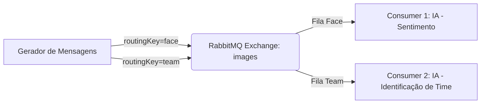

# ⚡ Sistema Distribuído com RabbitMQ, Java e IA

Este projeto implementa um **sistema distribuído em containers Docker** que utiliza **RabbitMQ como broker de mensagens** e dois consumidores com inteligência artificial embarcada usando a biblioteca **Smile**.  

O sistema gera uma carga constante de mensagens (imagens fictícias de rostos e brasões de times de futebol), roteia via RabbitMQ e processa em dois serviços consumidores distintos.  

---

## 📦 Arquitetura do Sistema

O sistema possui **4 containers**:

1. **Gerador de Mensagens (Message Generator)**  
   - Gera mensagens rápidas (≥ 5 mensagens/segundo).  
   - Tipos de mensagens:  
     - **Rosto de pessoa** (feliz/triste).  
     - **Brasão de time de futebol**.  
   - Publica mensagens no **Exchange `images`** do RabbitMQ com routing keys:
     - `face` → mensagens de pessoas.  
     - `team` → mensagens de times.  

2. **RabbitMQ**  
   - Atua como **broker de mensagens**.  
   - Usa **Topic Exchange** para rotear mensagens para os consumidores corretos.  
   - Cada consumidor recebe somente os tipos de mensagens que precisa processar.  

3. **Consumidor 1 (Consumer Face)**  
   - Recebe mensagens de rostos.  
   - Processa com IA (exemplo: **análise de sentimento** usando Smile).  
   - Diz se a pessoa está **feliz** ou **triste**.  

4. **Consumidor 2 (Consumer Team)**  
   - Recebe mensagens de times de futebol.  
   - Processa com IA (exemplo: **identificação de brasão de time** com Smile).  
   - Diz a qual time aquele brasão pertence.  

---

## 🗂️ Estrutura do Projeto

```
.
├── Dataset_aliens/       # Pasta com as fotos das "pessoas"
├── Dataset_times/        # Pasta com as fotos dos brasões de times
├── consumerFace/         # Pasta com os arquivos da IA de emoções
├── consumerTeam/         # Pasta com os arquivos da IA de times 
├── message-generator/    # Pasta com os arquivos do gerador de mensagens
└── docker-compose.yml
```

---

## 🚀 Como Executar

### 1️⃣ Pré-requisitos
- [Docker](https://www.docker.com/)  
- [Docker Compose](https://docs.docker.com/compose/)  

### 2️⃣ Subir os containers
```bash
docker-compose up --build
```

### 3️⃣ Derrubar os containers
```bash
docker-compose down
```


---

## ⚙️ Tecnologias Utilizadas

- **Java 17**  
- **RabbitMQ** (mensageria distribuída)  
- **Docker + Docker Compose** (containerização)  
- **Smile** (biblioteca de Machine Learning em Java)  

---

## 📊 Fluxo de Mensagens



---

## 🤖 Exemplos de Saída

### Gerador de Mensagens
```
[ENVIADO] Tipo: Rosto de pessoa | Imagem: feliz1.jpg | Timestamp: 1696200000000
[ENVIADO] Tipo: Brasão de time | Imagem: time2.png | Timestamp: 1696200000500
```

### Consumer Face
```
[RECEBIDO] feliz1.jpg → Classificação: Pessoa está FELIZ 😃
```

### Consumer Team
```
[RECEBIDO] time2.png → Classificação: Time identificado: Flamengo 🟥⬛
```